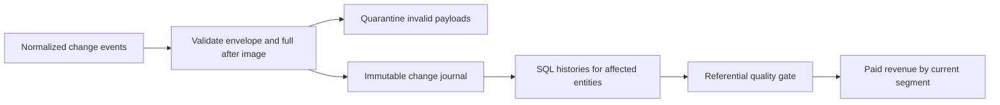

# Commerce CDC

**A replayable commerce warehouse that preserves customer history when database changes arrive late.**

An analytics team needs current orders and revenue by customer segment without
counting retries twice, reviving deleted orders, or losing a customer's previous
segment. This project implements that sink with Python, SQLite and SQL window
functions. All sample events are synthetic; currency values are integer AUD cents.

## Run in under a minute

Python 3.12+ with SQLite 3.25+ and JSON support. No packages, credentials or services.
Run these commands from this directory (including an extracted source download):

```bash
python3 pipeline.py demo
python3 -m unittest discover -s tests -v
```

The demo ingests 12 deliveries, then immediately replays them:

| Evidence | First pass | Replay |
|---|---:|---:|
| Accepted changes | 9 | 0 |
| Duplicate deliveries | 1 | 10 |
| Invalid deliveries | 2 | 2 |
| Durable quarantine rows | 2 | 2 |

The published warehouse contains five customer history versions, two customer
keys (including a deletion tombstone), one current order, and exactly **15,000
cents of paid revenue**. The source ledger contains nine unique changes.
Quarantine counts in ingestion results count deliveries; the table deduplicates
identical invalid payloads.

For persistent state without resetting it:

```bash
python3 pipeline.py ingest --database warehouse.sqlite --input data/changes.json
python3 pipeline.py report --database warehouse.sqlite
```

## Architecture and contract



`schema_version`, `event_id`, `position`, `entity`, `entity_id`, `op` and `after`
are required. Unknown fields and versions are quarantined. Operations are snapshot
read (`r`), create (`c`), update (`u`) and delete (`d`); a delete requires a null
after image. Every non-delete has a complete after image, never a partial patch.
Customer records intentionally contain no names, email addresses or other direct
identifiers. IDs and segments are synthetic, not anonymized production data.

`position` is a **unique total order within one normalized source stream**. It is
not a PostgreSQL LSN or a broker offset. A real connector adapter must combine
source partition, transaction and row ordering and coordinate its initial snapshot
before emitting this contract. This project does not run that adapter.

History uses half-open `[valid_from, valid_to)` source-position intervals. SQL
`LEAD` repairs those intervals after an older change arrives; the greatest source
position determines current state. Deletes stay in the journal and as customer
tombstones, so an older delivery cannot resurrect an entity. This is source-order
history, not business-effective-time history and not a privacy erasure mechanism.

Ledger insertion, quarantine, derived tables and the orphan-order check commit
in one database transaction. Conflicting event identities or source positions
abort the batch. Missing customers abort publication, allowing the same batch to
be retried with the missing dependency. The revenue view groups **current paid
orders by current customer segment**; it does not pretend to be a financial ledger.

## Failure drills

- Replay the file: source, history, orders and revenue stay unchanged.
- Send position 50 after 60: history gains an interval; current segment stays premium.
- Delete an order, then send an older change: the order remains absent.
- Crash before publication: journal inserts and derived changes roll back together.
- Reuse an identity with different data: fail visibly, preserving prior output.
- Restart the process: persisted state and replay protection survive.
- Change the schema or send a negative amount: retain the rejected payload and reason.

The thirteen executable tests in `tests/test_warehouse.py` cover these paths, including
referential recovery, randomized out-of-order batches, independent reconciliation,
zero-write replay and transactional repair.

## Incremental updates, audit and repair

```bash
python3 workload.py
python3 pipeline.py ingest --database warehouse.sqlite --input data/changes.json
python3 pipeline.py audit --database warehouse.sqlite
python3 pipeline.py rebuild --database warehouse.sqlite
```

The synthetic workload seeds **2,000 customers and 2,000 orders**, then changes
one customer's segment. That update touches one customer, zero orders and **five
derived rows** (inserts plus deletes). A subsequent full rebuild of exactly that
state writes **12,002 derived rows**. Both agree with an independent Python fold
of the immutable journal. `workload.py` reproduces these counts; this measures
write work, not elapsed time, latency, memory or throughput. The recorded result
is included in the source download as `workload-output.json`.

`audit` compares every history, customer and order row against that independent
fold. It reports missing and unexpected rows and exits nonzero on drift. It uses
one database read snapshot and makes no repairs. `rebuild` explicitly reconstructs
derived tables from the accepted journal in one transaction; it preserves source
and quarantine records. A failure rolls back the repair. Keep a database backup
before repairs; the journal is the authority and this does not repair a corrupted
journal or restore omitted upstream changes.

A seeded randomized test delivers 200 changes in shuffled batches with duplicate
retries, checking every intermediate state against the independent fold. An SQL
trigger test fails if a customer-only change rewrites unrelated orders or customers.

## Operating and scaling decisions

Use `report` to reconcile journal, history and mart counts. Inspect `quarantine`
for contract errors. Repair an invalid source record with a new event ID and source
position; retain the original rejected payload. For orphan failures, supply the
missing customer and replay the aborted batch. Do not change a previously accepted
payload under its existing ID. Preserve the database and normalized log before
changing contracts; demo mode defaults to an isolated in-memory database.

The materializer rebuilds only affected entity histories and current rows. It
retains all journal versions for each affected key, so an older delivery still
repairs the full history for that key. Duplicate-only batches write no derived
rows. This reduces writes, but the reference check still scans current orders;
one heavily updated customer's history still grows, and a full audit reads the
complete journal. This is not a claim of constant-time or production throughput. SQLite serializes writers and this project has
no Kafka consumer, WAL reader, distributed transaction, broker checkpoint,
source-transaction boundary, production benchmark or deployed infrastructure.
A broker consumer would acknowledge only after the sink commits; replay is how it
would recover from a crash between those actions. Source-transaction buffering and
snapshot coordination need separate implementation and integration tests.

## Design reference

[Debezium's PostgreSQL connector](https://debezium.io/documentation/reference/stable/connectors/postgresql.html)
documents snapshot and row-change envelopes. Its operation vocabulary informed
this smaller local contract; wire compatibility is not claimed. Source ordering,
identity and snapshot coordination are deliberate adapter responsibilities.

[SQLite transactions](https://www.sqlite.org/lang_transaction.html) and
[window functions](https://www.sqlite.org/windowfunctions.html) underpin the
atomic publication and per-entity history queries.
