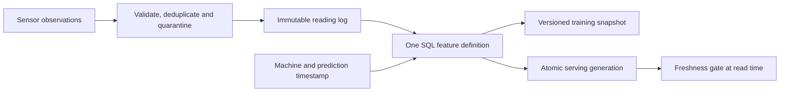

# SignalForge

**Point-in-time feature data for predictive maintenance, with an explicit cutoff for what the system knew.**

A maintenance model must train on sensor readings available when a prediction
would have been made. A delayed reading can have an old event timestamp and still
leak future information into a historical training row. SignalForge makes that
failure reproducible and applies the same SQL feature definition to historical
training and a local serving snapshot.

This is the data pipeline behind a possible model, with synthetic machine data.
It does not train a model or claim improvements to maintenance outcomes.

## Run in under a minute

Python 3.12+ with SQLite 3.25+ and JSON support. No packages or cloud credentials.
Run from this directory (including an extracted source download):

```bash
python3 pipeline.py demo
python3 -m unittest discover -s tests -v
```

Six deliveries yield four valid readings, one duplicate and one quarantined
out-of-range temperature. At the fixture's 10:00 UTC prediction time:

| Reading | Event time | Available at | Eligible? |
|---|---|---|---|
| `a-known` | 09:40 | 09:41 | Yes: 68°C, 2.4 mm/s vibration |
| `a-delayed` | 09:55 | 10:20 | No: not yet known |
| `a-future` | 10:05 | 10:06 | No: future event |
| `b-expired` | 08:00 | 08:01 | No: beyond the one-hour TTL |

The training set retains all three prediction requests, including null features
for an expired machine and an unseen machine. At the same cutoff, the serving
snapshot returns the same feature values. At 12:00, that cached reading is stale
and the serving read returns no features.

## Architecture



The SQL join enforces all three conditions for each prediction request:

```text
event_time <= prediction_time
available_at <= prediction_time
event_time >= prediction_time - 3600 seconds
```

Within the eligible readings it chooses the latest event time, then latest
availability time, then reading ID for a deterministic tie break. Repeated machine
IDs are supported; request IDs must be unique. Units are integer thousandths of
°C and mm/s to keep comparisons deterministic. Timestamps require an explicit
timezone and whole-second precision. An input available before its event time is
quarantined as a source-clock or contract error.

`available_at` means first usable availability in this system. A real ingestion
adapter must assign and retain it from a trusted clock. Backdating it to event time
would defeat this protection. The fixture supplies that clock explicitly; it is
not an independently verified ingestion timestamp.

A training snapshot records its rows, a hash of the SQL and TTL definition, a hash
of the accepted source contents, and a deterministic snapshot ID. Older snapshots
remain stored when new data arrives. The manifest is reproducible for the same
source and definition; it does not version executable Python or labels.

## Failure drills and recovery

The seventeen tests in `tests/test_features.py` exercise leakage, repeated entities,
reproducibility, training/serving parity, exact TTL boundaries, invalid readings,
replay, identity conflicts, process restarts, atomic publication failure, coverage
thresholds, unseen machines and recovery after missing telemetry arrives.
One test runs a naive event-time-only join and proves that it picks the delayed
reading, then verifies that the actual feature query excludes it.

A failed serving publication rolls back to the last good generation. Reads check
TTL again as time advances. A changed SQL definition blocks old serving features
until rematerialization; an earlier cutoff cannot overwrite a newer generation.
`missing`, `stale`, `not_materialized` and `definition_changed` are explicit states
that a caller must handle. There is no silent imputation or invented zero value.

## Coverage gates before publication

```bash
python3 pipeline.py demo
python3 pipeline.py quality --database features.sqlite --input data/requests.json --min-coverage 100
python3 pipeline.py materialize --database features.sqlite --at 2026-09-01T10:00:00Z --machines data/machines.json --min-coverage 100
```

Run the demo in memory, or ingest your readings into `features.sqlite` before the
last two commands. The bundled roster intentionally includes three machines with
only one ready at 10:00, so a 100% gate exits **1** with a structured JSON report.
On an empty database all three are unknown and the gate also fails.

Coverage means **requests with an eligible reading / all requested predictions**.
For serving, each unique machine in the explicit roster is one request. A machine
that never sent telemetry remains in the denominator. Training requests can
repeat machines at different prediction times. Every absent feature is explained:

- `expired`: a reading was known at the cutoff, but none meets the TTL.
- `no_known_reading`: no reading had become available at the cutoff, including
  unseen machines and those with only future or delayed readings.
- `ready`: a reading satisfies both time cutoffs and the TTL.

`--min-coverage` accepts an integer percentage from 0 to 100. Zero disables the
gate while retaining diagnostics. Nonzero serving gates require `--machines`;
they cannot silently infer a smaller population from machines that happened to
send data. Empty populations fail any nonzero threshold. Comparisons use integer
counts before rounding the displayed percentage.

A rejected serving generation leaves the previous features, cutoff and coverage
report untouched. A rejected training snapshot is not saved. Coverage policy and
results are retained in accepted manifests and serving-generation metadata.
The demo deliberately rejects an incomplete release and confirms the prior
generation survives. A recovery test appends the missing machine's reading and
then successfully publishes at 100% coverage.

A healthy release can still become stale later, so read-time TTL checks remain
active. Coverage measures availability, not sensor accuracy, distribution drift,
model quality or a service-level objective. The caller owns the expected roster.

## Use your own synthetic input

```bash
python3 pipeline.py ingest --database features.sqlite --input readings.json
python3 pipeline.py training --database features.sqlite --input requests.json
python3 pipeline.py materialize --database features.sqlite --at 2026-09-01T10:00:00Z
python3 pipeline.py online --database features.sqlite --machine machine-a --at 2026-09-01T10:00:00Z
```

`readings.json` is an array matching `readings` in `data/fixture.json`;
`requests.json` matches its `requests` array. `training` prints the manifest and
also stores it in `training_snapshots`; it supports `--min-coverage` too. Retain the source database if a run must be
reproduced. Duplicates are no-ops; a changed payload under the same reading ID aborts
the ingestion batch. Correct a reading by appending a new ID and truthful
availability timestamp, preserving the old reading for historical reconstruction.

## Limits and next production step

This is a single-process SQLite reference, not a deployed feature store. It uses
raw latest-reading features, one shared TTL, local serving snapshots and no API,
model registry, authentication or scheduler. Online parity is established at a
shared cutoff; new data will not be served until the next materialization. No
throughput, freshness SLO or model accuracy is claimed.

A production extension would use an append-only warehouse source, trusted ingest
metadata, an incremental materialization job and a low-latency serving store.
Evaluate late-data policy and training/serving skew before adding a model. Keep
knowledge-time tests when changing engines; event-time correctness alone does
not establish that a historical feature was available to a live predictor.

## Design reference

[Feast's point-in-time join documentation](https://github.com/feast-dev/feast/blob/master/docs/getting-started/concepts/point-in-time-joins.md)
describes historical feature retrieval and TTL lookback. SignalForge implements
its own SQL and additionally requires the explicit availability cutoff above;
it does not use Feast or claim that all feature-store joins enforce that cutoff.
